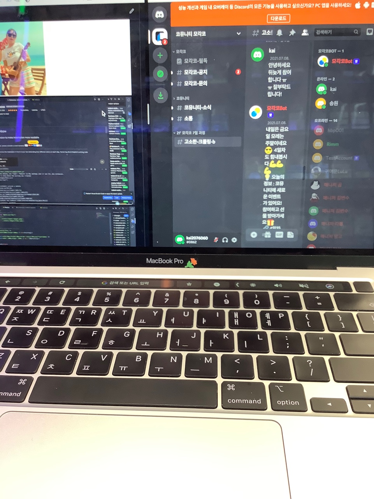

> **코뮤니티 모각코, 파이썬 크롤링!
✨4일차✨ 웹페이지의 가이드북, HTML**

## 📌 HTML 구조
오늘은 크롤링을 위해 알아야하는 HTML을 알아보겠습니다. 

✅ **오늘 배울 내용**
- HTML 태그
- 웹페이지의 HTML 구조

**✅ 고소한 크롤링 #4 HTML 구조**
👉 [https://cafe.naver.com/codeuniv/11287](https://cafe.naver.com/codeuniv/11287)
크롤링을 알기 위해서 먼저 웹 페이지에 대해서 알아야한다. => <웹페이지>에 대해 알아보자.
- 웹페이지는 HTML을 기반으로 한다.
- HTML(Hyper Text Markup Language) : 구조에 대한 정보를 기반으로 작성된 언어 -> 마크로 둘러싸인 언어
- 웹 페이지를 이루고 있는 구성 요소들에 대해 작성되어 있는 문서 또는 가이드북
- HTML이라는 문서를 통해 우리는 웹페이지가 어떻게 구성되어 있는지 알 수 있다!

이를 이용하여 원하는 데이터가 웹 페이지의 어디에 위치해 있는지 파악하여 수집하는 것이 크롤링의 핵심
### HTML 태그(Tag)
따라서 HTML에 있는 각각의 구성 요소는 마크의 역할을 하는 '태그'로 감싸져 있다.
```
<body><p1>안녕</p1></body>
```

## 🎯 오늘의 인증 미션 (다음날 AM 9:59까지)

✅ **오늘의 출석 미션**

👉 **공부할 때 필수 아이템**을 캡쳐하여 **출석/공부인증**에 공부 인증과 함께 올려주세요.

🚨 게시글을 올릴 때는 반드시 **게시판 이름(커리큘럼)**을 확인해주세요. 

여러분이 공부할 때 필수 아이템을 사진 찍어 올려주세요!


## 🎯 오늘의 문제

여러분의 답을 **[출석] 공부인증** 게시판에 올려주세요.

🚨 게시글을 올릴 때는 반드시 **게시판 이름(커리큘럼)**을 확인해주세요. 

✅ **오늘의 문제 : HTML 태그 찾기**

코뮤니티 '가입인사' 게시판에 들어가서 아래의 HTML 태그를 찾아보세요! 


---
크롤링 과정은 유난히 준비가 깁니다 😥 
코드리뷰는 5일차부터 시작될 예정입니다!
